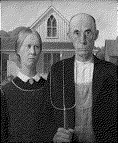
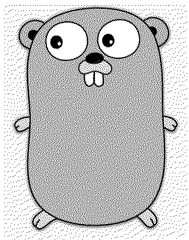

## Dithering

This is a simple project to demonstrate [Floyd–Steinberg dithering] as code.

## What

Floyd–Steinberg dithering is an image dithering algorithm first published in
1976 by Robert W. Floyd and Louis Steinberg. It is commonly used by image
manipulation software, for example when an image is converted into GIF format
that is restricted to a maximum of 256 colors.

## Why

One common application of dithering is to more accurately display graphics
containing a greater range of colors than the display hardware is capable of
showing. For example, dithering might be used in order to display a photographic
image containing millions of colors on video hardware that is only capable of
showing 256 colors at a time. The 256 available colors would be used to generate
a dithered approximation of the original image. Without dithering, the colors in
the original image would be quantized to the closest available color, resulting
in a displayed image that is a poor representation of the original.

## How

The algorithm achieves dithering using error diffusion, meaning it pushes (adds)
the residual quantization error of a pixel onto its neighboring pixels, to be
dealt with later. It spreads the debt out according to the distribution (shown
as a map of the neighboring pixels):


A version of this algorithm can be seen in [pkg/dithering.go].

## Requirements

- [Go 1.18]

## Bulid

```console
$ make build
```

## Run

```console
$ ./build/dither -h
$ ./build/dither --in foo.png --out bar.png
$ make examples
```

## Test

```console
$ make test
$ make lint # requires golangci-lint installed
```

## Verify CI Locally

Install [act] on your machine. <sup>This runs GitHub workflows locally.</sup>

```console
$ act push
```

## Examples

| Original                                            | Dithered                                                  |
| --------------------------------------------------- | --------------------------------------------------------- |
|  |  |
|                        |                        |
|                |                |
|                    |                    |
|        |        |

| Factor   | Image                                   |
| -------- | --------------------------------------- |
| Original |       |
| 1        |  |
| 2        |  |
| 3        |  |
| 4        |  |

[Go 1.18]: https://go.dev/
[Floyd–Steinberg dithering]: https://en.wikipedia.org/wiki/Floyd%E2%80%93Steinberg_dithering
[act]: https://github.com/nektos/act
[pkg/dithering.go]: pkg/dithering.go
