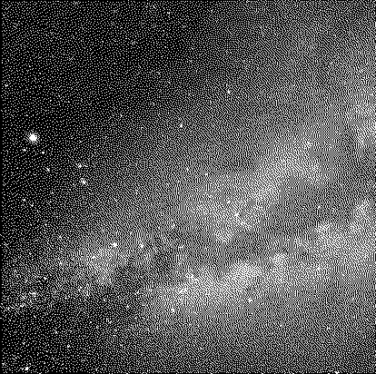

## Dithering

This is a simple project to demonstrate [Floyd–Steinberg dithering] as code.


## Requirements
* [Go 1.18]

## Bulid
```console
make build
```

## Run
```console
./build/dither -h
./build/dither --in foo.png --out bar.png
make examples
```

## Test

```console
make test
make lint # requires golangci-lint installed
```

## Examples

| Original                                            | Dithered                                                  |
|-----------------------------------------------------|-----------------------------------------------------------|
|  |  |
|                        |                        |
|                |                |
|                    |                    |
|        |        |

| Factor   | Image                                   |
|----------|-----------------------------------------|
| Original |       |
| 1        |  |
| 2        |  |
| 3        |  |
| 4        |  |

[Go 1.18]: https://go.dev/
[Floyd–Steinberg dithering]: https://en.wikipedia.org/wiki/Floyd%E2%80%93Steinberg_dithering
